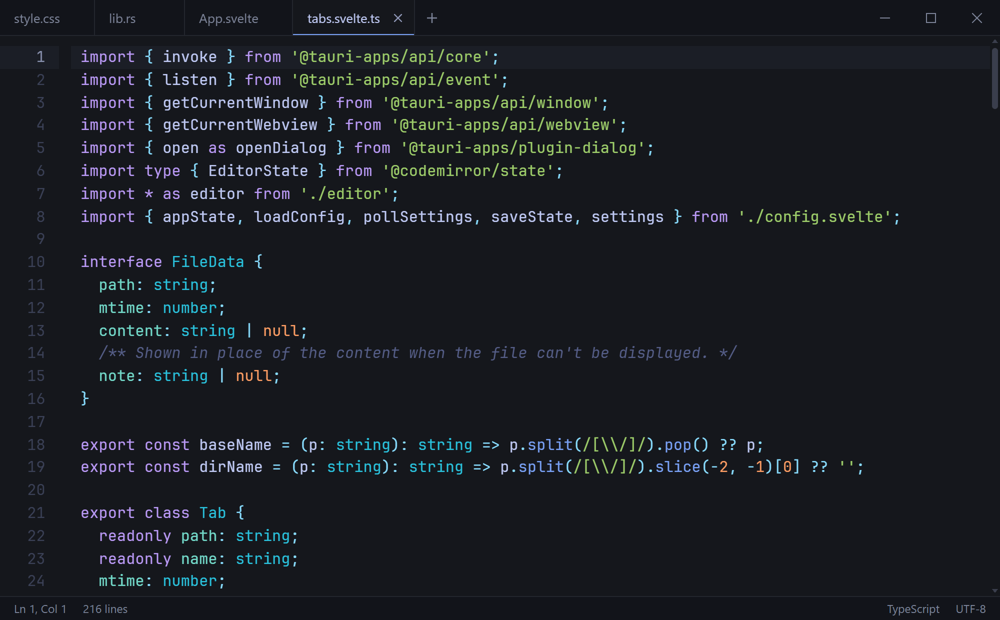

# Codepad

A small, good-looking code viewer. Open a file, read it, close it. **No file tree, no project, just tabs.**

<picture>
  <source media="(prefers-color-scheme: light)" srcset="assets/screenshot-light.png">
  
</picture>

Codepad is for the moments when you just want to *look* at some code and VS Code is more than you need. It starts instantly, it's a ~4 MB download, and it doesn't try to be an editor: files open read-only, and editing is something you switch on if you want it.

It's inspired by [Markpad](https://github.com/sftwrdotdev/Markpad), which does the same job for Markdown. Codepad is the same idea for code, with a basic Markdown preview built in.

## Features

- **Lightweight.** A Tauri app (Rust + the system WebView2), not Electron. About 4 MB portable.
- **Tabs only.** No sidebar, no explorer, no workspace. Open files from the dialog, drag them in, or pass them on the command line.
- **Syntax highlighting** for a wide range of languages, powered by CodeMirror 6. Languages load on demand.
- **Live updates.** Files are re-read when they change on disk, so Codepad works as a viewer for logs and generated output.
- **Command palette** (`F1` or `Ctrl+Shift+P`) with fuzzy search for everything: open and close files, switch tabs, go to line, zoom, theme, and more.
- **Light editing, off by default.** Turn on `editable` for undo/redo, auto-indent, `Ctrl+S`, an unsaved dot on the tab, and a prompt before you close anything unsaved. Optional auto save. **New File** (`Ctrl+N`) and **Save As** work too.
- **Encodings and line endings.** UTF-8, UTF-16, Windows code pages, Shift JIS, GBK and more. The status bar shows the encoding and line ending of the current file; click either to reopen with another encoding, save in one, or switch between LF and CRLF.
- **Markdown preview.** Markdown files get a **Code / Split / Preview** switch in the status bar (`Ctrl+Shift+V` toggles the preview). Split view scrolls the text and the rendered page together. Tables, task lists, code blocks (highlighted), local images and links all work, and raw HTML is sanitised. It's a quick look, not a full reader.
- **Open with Codepad** in the Explorer right-click menu, for text and code files only (not images, executables and the like). The installer asks; you can also switch it on or off any time from the command palette (**Explorer Menu**), which also works for the portable exe.
- **Search across open tabs** (`Ctrl+Shift+F`): results grouped by file, with match case, whole word and regex.
- **Minimap**, off by default, with the same options as VS Code's `editor.minimap`.
- **Find** (`Ctrl+F`) with a VS Code-style floating widget: match case, whole word, regex, match count, and replace (with capture groups) when editing is on.
- **Dark and light themes**, or follow the system setting.
- **Updates itself on request.** A quiet notice tells you when a new release is out; nothing downloads or installs until you say so.
- **Remembers your tabs** between launches, or starts empty if you'd rather. The window's size, position and maximised state are remembered too.
- **Says so when something goes wrong.** A file that can't be opened or saved shows a short message instead of failing silently.
- **One window.** Opening a file from Explorer while Codepad is running adds a tab to the existing window, and the same file is never opened twice.

## Install

Download the latest build from the [Releases page](https://github.com/Cauze/Codepad/releases/latest):

| File | |
| --- | --- |
| `Codepad_x.y.z_x64-setup.exe` | Installer. Asks whether to add **Open with Codepad** to the right-click menu and `codepad` to your PATH; uninstalling removes both again. |
| `Codepad_x.y.z_x64-portable.exe` | Portable: a single exe, nothing to install |

Windows 10 or 11 is required. The builds aren't code-signed yet, so SmartScreen may warn you the first time you run them.

## Usage

Open files with `Ctrl+O`, drag them onto the window, or run `Codepad.exe path\to\file.rs`. If you add Codepad to your PATH (the installer offers it, or use **Command Line: Add "codepad" to PATH** in the palette), `codepad file.rs` works from any terminal: cmd, PowerShell and Git Bash. Open a new terminal after turning it on. Everything else is in the command palette, so if you only remember one shortcut, make it `F1`.

| Shortcut | Action |
| --- | --- |
| `F1` / `Ctrl+Shift+P` | Command palette |
| `Ctrl+O` | Open file |
| `Ctrl+N` | New file |
| `Ctrl+P` | Switch tab |
| `Ctrl+G` | Go to line (`42` or `42:7`) |
| `Ctrl+F` / `Ctrl+H` | Find / find and replace (when editing is on) |
| `Ctrl+S` / `Ctrl+Shift+S` / `Ctrl+Alt+S` | Save / save as / save all (when editing is on) |
| `Ctrl+Shift+F` | Search across open tabs |
| `Ctrl+Shift+V` | Toggle Markdown preview |
| `Ctrl+W` | Close current file |
| `Ctrl+Tab` / `Ctrl+Shift+Tab` | Next / previous tab |
| `Ctrl+1` … `Ctrl+9` | Jump to tab |
| `Ctrl+=` / `Ctrl+-` / `Ctrl+0` | Zoom in / out / reset (also `Ctrl+Scroll`) |
| `Alt+Z` | Toggle word wrap |
| `Ctrl+Q` | Quit |

## Updates

Codepad checks GitHub Releases for a newer version a few seconds after launch (turn this off with `checkForUpdates`). If there is one, a small notice appears with **Update & restart** and **Release notes**. Dismissing it leaves a discreet `↑ 0.2.0 available` in the status bar. Nothing is ever downloaded or installed automatically.

You can also run **Check for Updates** (and **Install Update**) from the command palette at any time.

- **Installer build:** downloads the new `-setup.exe`, runs it, and Codepad restarts when it finishes.
- **Portable build:** downloads the new exe and swaps it in place, then restarts.

Every download is checked against the SHA-256 checksum GitHub publishes for the release file, and discarded if it doesn't match. There's no update server: Codepad only talks to `api.github.com` and `github.com`.

## Settings

Settings live in `%APPDATA%\Codepad\settings.json`. Open it with **Open Settings File** in the command palette. It is always editable, even with `editable` off, and saving it applies the changes immediately. Changes are picked up while Codepad is running.

```json
{
  "theme": "system",
  "editable": false,
  "autoSave": "off",
  "autoSaveDelay": 1000,
  "startup": "restore",
  "checkForUpdates": true,
  "cursorStyle": "line",
  "cursorBlink": true,
  "smoothCursor": false,
  "defaultLineEnding": "lf",
  "markdownDefaultView": "code",
  "minimap": { "enabled": false },
  "fontSize": 13.5,
  "fontFamily": "",
  "lineHeight": 1.6,
  "wordWrap": false,
  "lineNumbers": true
}
```

| Setting | Values |
| --- | --- |
| `theme` | `"system"`, `"dark"`, `"light"` |
| `editable` | `true` lets you edit and save files. `false` keeps Codepad a pure viewer. Also in the command palette: **Enable Editing** / **Disable Editing**. |
| `autoSave` | `"off"` saves only on `Ctrl+S`. `"afterDelay"` saves shortly after you stop typing. `"onFocusChange"` saves when you switch tabs or leave the window. |
| `autoSaveDelay` | Milliseconds to wait for `"afterDelay"`, 200 to 60000 |
| `startup` | `"restore"` reopens the tabs from last time, `"empty"` starts with none |
| `checkForUpdates` | `true` looks for a newer release a few seconds after launch and shows a notice if there is one. `false` only checks when you ask. |
| `cursorStyle` | `"line"`, `"block"`, `"underline"` |
| `cursorBlink` | `true` / `false` |
| `smoothCursor` | `true` glides the cursor to its new position instead of jumping. `false` jumps. |
| `defaultLineEnding` | `"lf"` or `"crlf"`: the line ending for new files. Existing files keep theirs. |
| `markdownDefaultView` | How Markdown files open: `"code"` (text only), `"split"` or `"preview"`. |
| `minimap` | An object, shown below. `enabled` is `false` by default. |
| `fontSize` | 9 to 28 |
| `fontFamily` | Any installed font, e.g. `"JetBrains Mono"`. Empty uses the built-in monospace stack. |
| `lineHeight` | 1 to 3, as a multiple of the font size |
| `wordWrap` | `true` / `false` |
| `lineNumbers` | `true` / `false` |

### Minimap

```json
"minimap": {
  "enabled": true,
  "side": "right",
  "showSlider": "mouseover",
  "renderCharacters": true,
  "maxColumn": 120,
  "scale": 1,
  "size": "proportional"
}
```

These follow VS Code's `editor.minimap.*` settings: `side` is `"right"` or `"left"`, `showSlider` is `"mouseover"` or `"always"`, `renderCharacters` draws letters instead of blocks, `maxColumn` limits how many columns are drawn, `scale` is 1 to 3, and `size` is `"proportional"`, `"fill"` or `"fit"`. Everything is also in the command palette.

### Editing

Codepad keeps the file's encoding, line endings (LF or CRLF) and byte-order mark when it saves. It detects UTF-8 and UTF-16 by themselves and falls back to Windows-1252 for anything else; if that guess is wrong, use **Reopen with Encoding**. Binary files and files over 20 MB stay read-only, because saving them could corrupt them, and saving text that the chosen encoding can't represent is refused rather than silently mangled. If a file changes on disk while you have unsaved edits, Codepad never replaces your text; the tab turns amber, and saving asks before overwriting the other change. **Revert File** in the palette reloads from disk.

Your open tabs and recent files are kept separately in `state.json` in the same folder.

## Building from source

You'll need [Node.js](https://nodejs.org/) 22+, [Rust](https://rustup.rs/), and the [Tauri prerequisites](https://v2.tauri.app/start/prerequisites/) for Windows.

```bash
npm install
npm run tauri dev                    # run with hot reload
npx tauri build --no-bundle          # portable exe -> src-tauri/target/release/codepad.exe
npx tauri build --bundles nsis       # installer   -> src-tauri/target/release/bundle/nsis/
```

The frontend is Svelte 5 and TypeScript, bundled with Vite. The backend is a small amount of Rust for file access and config storage.

Pushing a tag like `v0.2.0` runs the release workflow, which builds both Windows files and publishes them to a GitHub release. The tag has to match the version in `package.json`, `src-tauri/tauri.conf.json` and `src-tauri/Cargo.toml`. The release notes are generated from the commit messages since the previous tag, so keep the first line of each commit readable.

## Tests

```bash
npm run check                        # type-check the frontend
npm test                             # Rust unit tests
npm run test:e2e                     # end-to-end tests against the built exe
npm run test:e2e -- find encodings   # only the files whose name contains one of these words
```

The end-to-end tests live in `tests/e2e`, one file per feature. Each one starts the real exe, drives it over WebView2's DevTools port (no mouse or keyboard takeover, so you can keep working), and checks what the app does. Build the exe first with `npx tauri build --no-bundle`, or point `CODEPAD_EXE` at another build, and close Codepad before running them, because the app is single-instance. The tests swap in their own settings and put yours back afterwards. `command-line` and `explorer-menu` change your PATH and right-click menu, so they skip themselves if you already have those switched on.

## License

[MIT](LICENSE)
